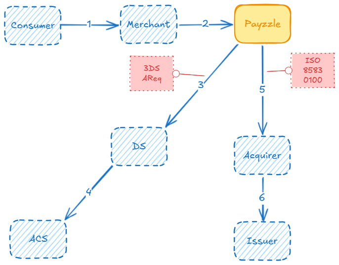

# Payzzle: Payment Orchestration System

## Architecture

### Payment flow

A payment is processed in two steps:
* *Authentication.* The card owner is authenticated using [EMV 3-DS](https://www.emvco.com/specifications/emv-3-d-secure-protocol-and-core-functions-specification-6/) specification.
* *Authorization.* The payment is authorized using [ISO 8583](https://www.iso.org/standard/79451.html) specification.

## Tools and technologies

* Java 21
* Spring Boot 3
* PostgreSQL
